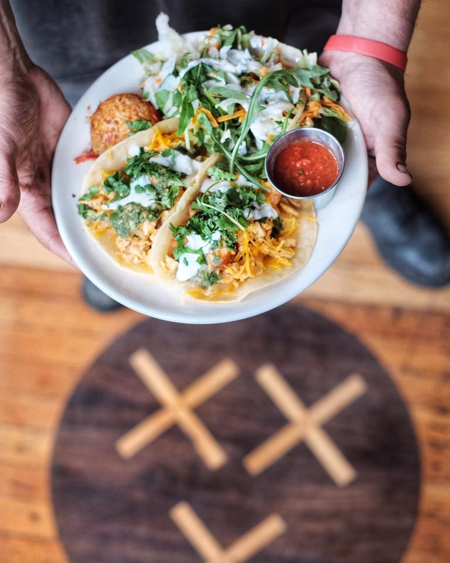
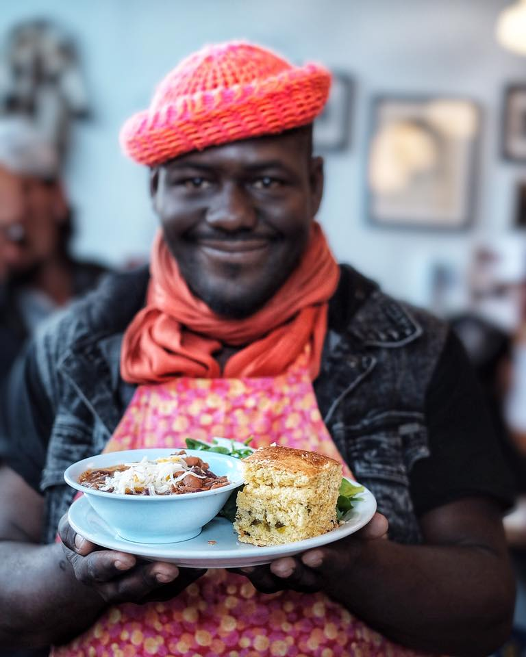

# project-two-template
Project two template for des 341
<main class = "content">
  

    <h1 class="h1home"> SISTERS OF THE ROAD </h1>
    <h2 class="h2home"> ABOUT US </h2>
    <h2 class="h2home"> JOIN US FOR LUNCH </h2>
    <h2 class="h2home"> OUR MENU <h2>
  

  

    <h1 class="h3home">MORE RESOURCES</h1>
    <h1 class="h3home">GET INVOLVED</h1>
    <h1 class="h3home">CONTACT US</h1>
  

  

    <h1> </h1>
  

  

  

</main>

<main class = "background">
  

    
    
  

</main>

body {

}
.content {
	position: relative;
	grid-template-columns: 1fr 3fr 1fr;
	display: grid;
}
.backgroundImages {
	grid-template-columns:50% 50%;
	display: grid;
	overflow: hidden;
	margin-top: -60px;

}

.borderTop {
	background-color: white;
	position: fixed;
	margin: 5%;
	left: 0;
	right: 0;
	text-align: top;
	top: 5%;
	grid-template-columns: 3fr 1fr 1fr 1fr;
	display: grid;
}

.h2home {
	text-decoration: none;
	font-size: 12px;
	text-align: center;
	margin: 10px;
}

.h1home {
	text-decoration: none;
	font-size: 12px;
	margin: 10px;
}

.borderRight {
	background-color: white;
	position:fixed;
	margin: 5%;
	left: 0px;
	right: 0px;
	top: 5%;
	grid-template-columns: 1fr 1fr 1fr;
	display: grid;
	transform: rotate(90deg);
}

.h3home {
	text-decoration: none;
	font-size: 12px;
	text-align: center;
	margin: 10px;
}
@media only screen and (min-width:768px) {

}

@media only screen and (min-width:1224px) {

}
